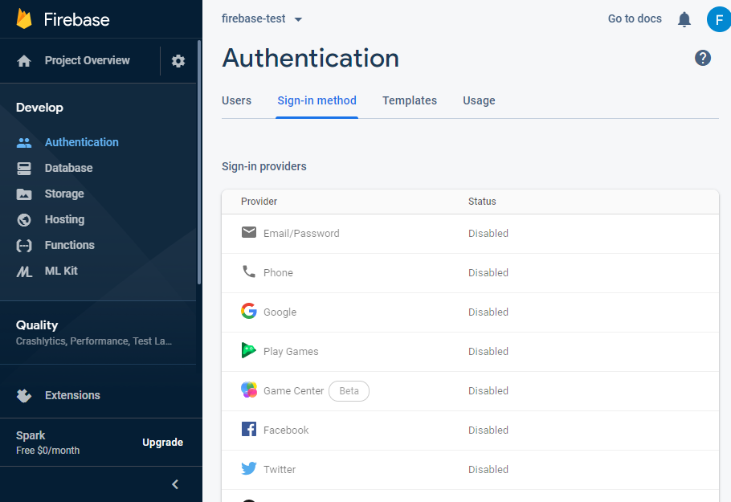

# firebase-authentication
Using Firebase Authentication on Websites

# Setup Firebase Authentication

1. From the [Firebase setup page](https://firebase.google.com/docs/web/setup), follow the steps 1 (Create a Firebase project) and 2 (Register your app).

2. Once you register the app, firebase will provide you the Firebase app credentials. Copy the credentials to the `environment.ts` file as the example below:

```
export const environment = {
  firebase: {
    apiKey: "api-key",
    authDomain: "project-id.firebaseapp.com",
    databaseURL: "https://project-id.firebaseio.com",
  projectId: "project-id",
    storageBucket: "project-id.appspot.com",
    messagingSenderId: "sender-id",
    appId: "app-id",
    measurementId: "G-measurement-id"
   }
};
```

3. Install `@angular/fire` - the official library for Firebase and Angular
4. Import the Firebase libraries into the `app.modules.ts`:

```
import { AngularFireModule } from '@angular/fire';
import { AngularFireAuthModule } from '@angular/fire/auth';
import { environment } from '../environments/environment';
```

and declare them on the Modules imports section (still on `app.modules.ts`):

```
imports: [
    AngularFireModule.initializeApp(environment.firebase),
    AngularFireAuthModule,
    ...
  ],
```

## Integrate Login Providers

Let's enable the Google sign-in option for the app.

1. To select which authentication method to integrate on the app, go to the Firebase project on Firebase console and click on *Develop > Authentication*. On *Sign-in method* tab, you can see all the sing-in options available through Firebase:



For each provider, there will be some specific configuration and setup steps to follow. 

### Google authentication setup

1. Enable Google sign-in provider and follow the instructions for the SHA1 fingerprint:


