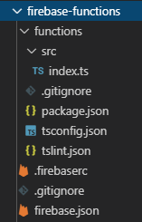

# firebase-functions
A Typescript project using Firebase functions

## Setup

1. If not yet done, create a firebase project. Check for instructions [here](https://firebase.google.com/docs/functions/get-started?authuser=0#create-a-firebase-project)
1. Install Node.js and npm
1. Install firebase tools using `npm install -g firebase-tools`. Using -g will install it globally.

## Initialize Firebase
1. Use `firebase login` cmd to login
1. Run `firebase init functions`. Choose typescript languange and decline the option to install dependencies with npm. Here is how the project should look like:



- The function folder should contain all your functions code.
- the index.ts is the main source file

## Run helloWorld function locally

1. Cd to functions folder.
1. Run `npm install` to install your dependencies
2. Run your functions locally using `npm run shell` cmd. On the terminal, you will see a list of functions that were loaded:

```
+  functions: Emulator started at http://localhost:5000
i  functions: Loaded functions: helloWorld
firebase >
```

3. Run helloWOrld function by typing `hellowWorld()` into the terminal. You should get a 200 response.

```
firebase > helloWorld()
Sent request to function.
firebase >
RESPONSE RECEIVED FROM FUNCTION: 200, Hello from Firebase!
```

## Deploy Cloud Functions

Cd to functions folder and run ` npm run deploy`.
